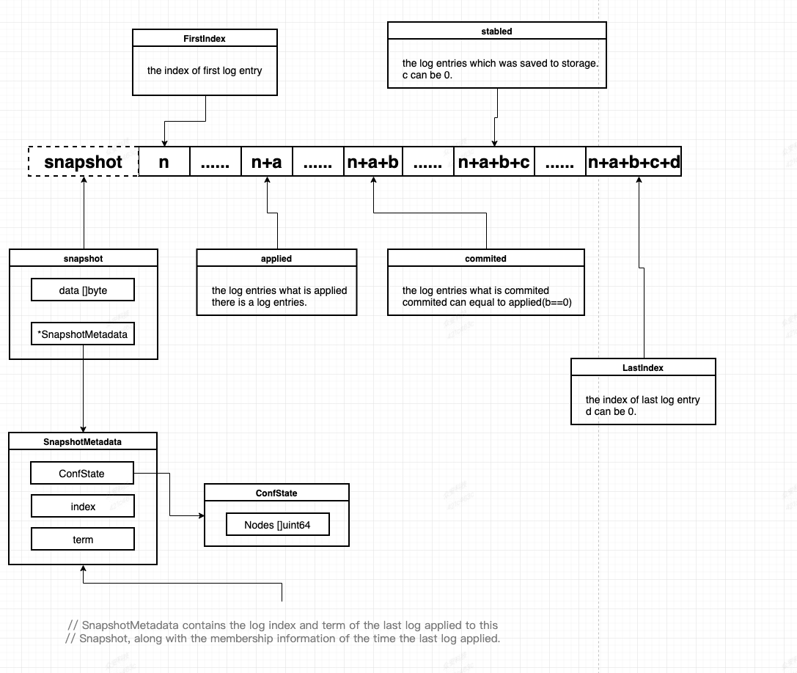

# go test
## 熟悉业务，熟悉设计
## 测试覆盖全面，保证正确率
# 架构分层<架构师，选择，架构分层>

# 一、tinykv 
 **总体架构（from tinykv readme.md）**

> 上图，是整个系统的架构图；可以看出整个系统分为三部分：tinySQL，tinyscheduler，tinykv。  
- tinySQL 应该类似于tidb，负责sql解析，主要面向客户端（实际应用）。
- tinyscheduler 看名字就知道，负责调度的（这次challange也涉及2，3部分 ）：
  - 1、记录所有的region信息，负责对key的路由；
  - 2、region自动化split 
  - 3、region自动化调度
- tinykv 就是这次实现的主角了，这次工作内容主要如下：
  - 1、单机kv的实现 ： 其实就是基于badager的抽象、封装；
  - 2、raft算法实现
  - 3、raftStorage实现
  - 4、事务的实现

## 1、raft一致性算法
### 1.1、raft算法基本模块
> raft算法主要分为三个部分： Leader选举/日志拷贝/snapshot/节点变更。  

### 1.2、raft算法注意点
> 其实，一致性算法，本质上做的事情是排序；但是，主要解决的问题是异常问题，如果正常情况，是理解不来许多特殊的设定、特殊的处理的。所以，捋raft的时候，`一定要` `一定要` `一定要` 考虑异常流程——如果没有异常流程，是没法吃透一致性算法的。  
> 
> 异常情况一般是`节点异常`，`网络异常`。下面描述，都是基于发送者视角：
- 节点异常 
  - 消息不可达： 表现为链接断开，消息不可达来 —— 可能原因是crash 。
  - 消息无响应： 表现为消息有去无回（即超时）—— 可能原因是 节点进程卡死（比如死锁）等等；当然，可能是收到消息之后crash，但是，最终表现为消息不可达。

- 网络异常
  - 消息无响应： 可能是网络丢包、或者网络卡（这种情况一般比较少了）

### 1.3、raft基本结构
> 这里的raft算法基本是纯算法实现，其它必要条件（依赖部件）都是接口形式提供，所以抽象程度很高。我一开始都特别不习惯。  
> raft是`日志副本`模型，日志一般有这么几种状态如下图

> 由上图可知，raft日志状态说明：

- stable/stabled : 这个上存储状态分段点，当然，这就必然需要一个storage。可以参考raft的`MemoryStorage`。
- commit : 这里的commit表示超过特定数目的节点已经接受到来log。
- apply : 状态机'apply'过的日志。这里的apply是仅仅write下，也可以是存储到kv中（必然redis中）。
- snapshot : 即日志已经被snapshot了，即没有存储日志记录了
  - 这里简单说明下，raft中的log是raft算法支撑的所有日志。日志中的数据，可以是各种类型的，必然说某种操作（要求每个节点都执行），比如说某种数据（要求每个节点都保存）。raft保证每个节点都由这个data，apply来保证data进行对应都操作。

### 1.4、pbft与raft的区别

## 2、raftkv（分布式kv）
- 消息类型注意：peerMsgHandler 处理等消息有如下几类：
  - MsgTypeRaftMessage : raft协议相关消息，比如vote消息，appendlog消息等等——raft节点完成算法本身需要进行的消息交互；
  - MsgTypeRaftCmd : raftkv本身支持的消息，比如Server.RawPut；这类消息一般情况下，都是需要先进行raft共识，然后再执行——比如这个put消息，先共识，然后每个raft节点执行保存到engine中去，就达到了一致性。
## 3、线性扩展

## 4、事务（mvcc/percolator)

# 二、思考

## 1、优化
### mvcc的testcase增加、完善
### storage抽象（好多地方都直接用到了badager的对象、接口。
### 优化

## 2、go test
### 熟悉业务，熟悉设计
### 测试覆盖全面，保证正确率
## 3、架构分层<架构师，选择，架构分层>

# 三、leveldb

# tinykv
## raft算法
